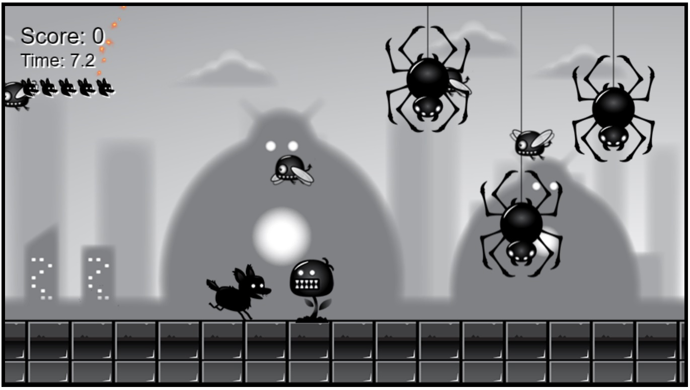

# Jax Side-Scroll Game

https://jaxpi.github.io/jax-side-scroll-game/
 

## Description

This JavaScript-based side-scroll game with components was created by following the tutorial by freeCodeCamp.org and frankslaboratory.co.uk found here: https://www.youtube.com/watch?v=GFO_txvwK_c. This projects was a way for me to gain exposure to the process of creating simple games using HTML, CSS, and JS only, as well as gain more practice utilizing JS skills and techniques. This is just a preliminary example of game creation that I will use to continue to grow my game design skills.

## Usage

Pressing the arrow keys will allow the character "Shadowdog" to move around the play area or stop movement. Pressing spacebar will have Shadowdog enter a rolling state that can defeat enemies upon contact. Each enemy defeated adds to the score. When Shadowdog contacts an enemy while not in rolling state he gets dazed which pauses movement briefly and removes a life. The goal is to reach a certain number of enemy defeats within the time limit without losing all lives.

## Credits
Tutorial:
https://www.youtube.com/watch?v=GFO_txvwK_c

Art Assets:
https://bevouliin.com/

## License

MIT License

Copyright (c) 2022 Jackson Impellizeri

Permission is hereby granted, free of charge, to any person obtaining a copy
of this software and associated documentation files (the "Software"), to deal
in the Software without restriction, including without limitation the rights
to use, copy, modify, merge, publish, distribute, sublicense, and/or sell
copies of the Software, and to permit persons to whom the Software is
furnished to do so, subject to the following conditions:

The above copyright notice and this permission notice shall be included in all
copies or substantial portions of the Software.

THE SOFTWARE IS PROVIDED "AS IS", WITHOUT WARRANTY OF ANY KIND, EXPRESS OR
IMPLIED, INCLUDING BUT NOT LIMITED TO THE WARRANTIES OF MERCHANTABILITY,
FITNESS FOR A PARTICULAR PURPOSE AND NONINFRINGEMENT. IN NO EVENT SHALL THE
AUTHORS OR COPYRIGHT HOLDERS BE LIABLE FOR ANY CLAIM, DAMAGES OR OTHER
LIABILITY, WHETHER IN AN ACTION OF CONTRACT, TORT OR OTHERWISE, ARISING FROM,
OUT OF OR IN CONNECTION WITH THE SOFTWARE OR THE USE OR OTHER DEALINGS IN THE
SOFTWARE.
